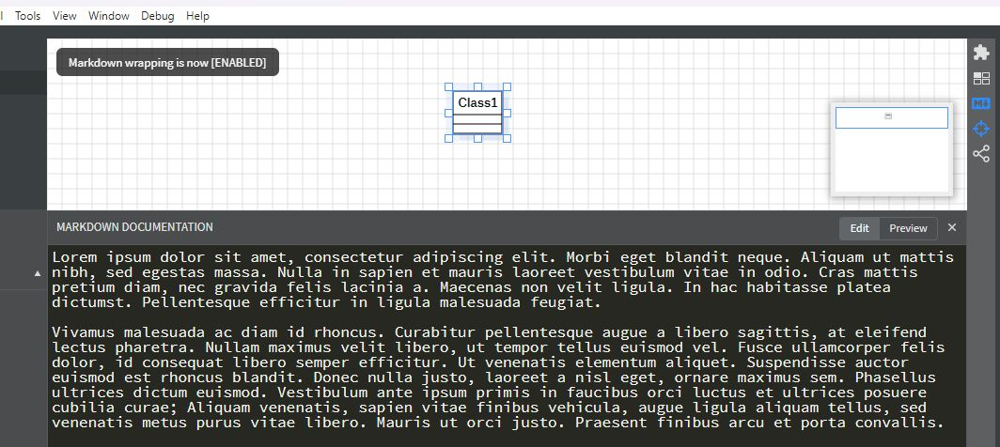

# About

This extension is used in order to change (*increase/decrease*) the fonts size in the StarUML's "MARKDOWN DOCUMENTATION" sections when this section is in "Edit" mode. This aids visibility of text and reduced eyes-strain.

Furthermore it can enable or disable the word-wrapping in this text section, thus the user not to have to scroll horizontally in order to read texts. The wrapping ability can also accessed using the `Alt+Z` shortcut key (windows)

# Examples

## Default view

Below a default view is show, with the menu opened. The size of the fonts in the MARKDOWN DOCUMENTATION section is relative small, and a lot of text is out of view.

## Increase Font Size

Using the first option "Set Markdown Text Size" and using value 16, the text is read easier.  
Still the text now is less visible.

## Enabling word wrapping

Enabling word-wrapping all the text is now visible!

